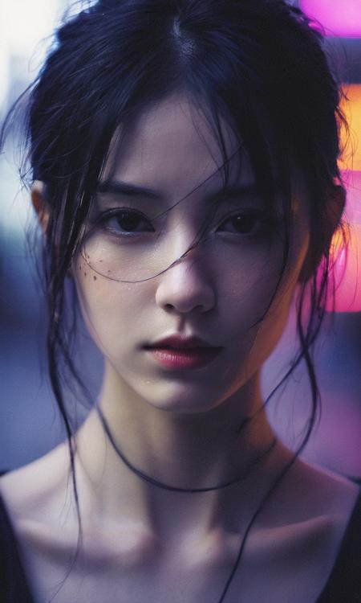

---
Type:
Trigger: undefined
note:
src: undefined
name: undefined
---

# XXMix_9realisticSDXL

## 介绍

https://tensor.art/u/596916453177820173/posts

## 触发词
xxmixgirl
没有触发词也可以，最好还是带上触发词

## 反向提示词
(worst quality, low quality, illustration, 3d, 2d, painting, cartoons, sketch), tooth, open mouth,bad hand,bad fingers,

图片尺寸:768*1280

全身：建议开hires，用ad修脸。

肖像照：可以不开hires，可以用ad修脸

采样次数：30

CFG Scale：8-10

目前角色失真感较强，皮肤纹理细节不够明显，我希望能在不断地迭代中改掉这些问题。

XXMix_9realisticSDXL是一个基于Stable Diffusion XL模型训练的微调模型，旨在提高Stable Diffusion XL在亚洲女性角色颜值方面糟糕的表现。目前的v1版本仍处于试验阶段，存在许多问题，但我会继续进行迭代优化。

触发词Trigger Words：xxmix girl woman（在某些情况下，可能需要增加关键词的权重）

目前已知的问题包括：

1.出现人物名字或者画风该脸型有几率不生效，这时，可以尝试增加触发词的权重。

2.由于模型是基于1024*1024的画幅进行训练的，因此其他比例的图片可能会导致较高的错误率。建议尽量使用1024*1024的画幅，我会在后续迭代中尝试使用不同画幅的训练集进行训练。

3.关于反向提示词：目前我们使用的反向提示词能够保持模型在亚洲脸部效果方面的良好表现。如果您尝试使用不同的反向提示词，效果可能不如我目前所使用的提示词。但是，如果您找到了更适合这个大型模型的反向提示词，我希望您能与大家分享。

4.由于画面比例的原因，目前这个模型更适合生成半身像或肖像。如果需要生成全身像，建议开启高清修复功能或使用faterdetail扩展插件。

